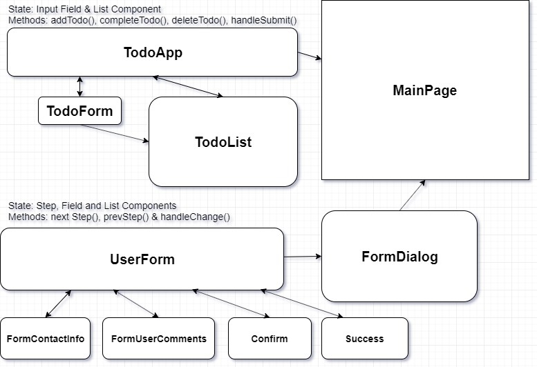

# Project 3: Task Management Web App

---

**Name:  Matt Heerspink**  
**Contact: mheerspink75@gmail.com**  
**Organization: Texas A&M University Kingsville**  
**Program:  Full Stack Web Development Bootcamp**  
**Project:  Task Management Web App**

## Abstract:  
The main purpose of this project is to build out a front end task management app with a fully functional todo list and contact form that use controlled components in React. The full project requirements can be found  [here](https://sites.google.com/view/reference-page/procject-3). 

## Workflow Requirements

### User Stories:

**1.** 

**2.** 

**3.** 

### Wireframes:

**1.** Todo List: [Wireframe 1](https://codesandbox.io/s/todolistapp-29m9s), [Wireframe 2](https://codesandbox.io/s/react-todo-list-use-state-bewkb)

**2.** Contact Form: [Wireframe](https://codesandbox.io/s/material-demo-0n53k)

**3.** Todo List App: [Wireframe](https://codesandbox.io/s/todoapp1-edit-59g2z)

---
### State and Component Planning

### Development Phase:

**1.** 

**2.** 

**3.** 

**4.** 

**5.** 

**6.** 

**7.** 

**8.** 

**9.** 

---
### Results:

#### Project URL: [https://mheerspink75.github.io/reactapp/](https://mheerspink75.github.io/reactapp/)

---

#### Desktop View:

#### Mobile View:

---

#### Future Improvements:

**1.** 

**2.**  

**3.**  

